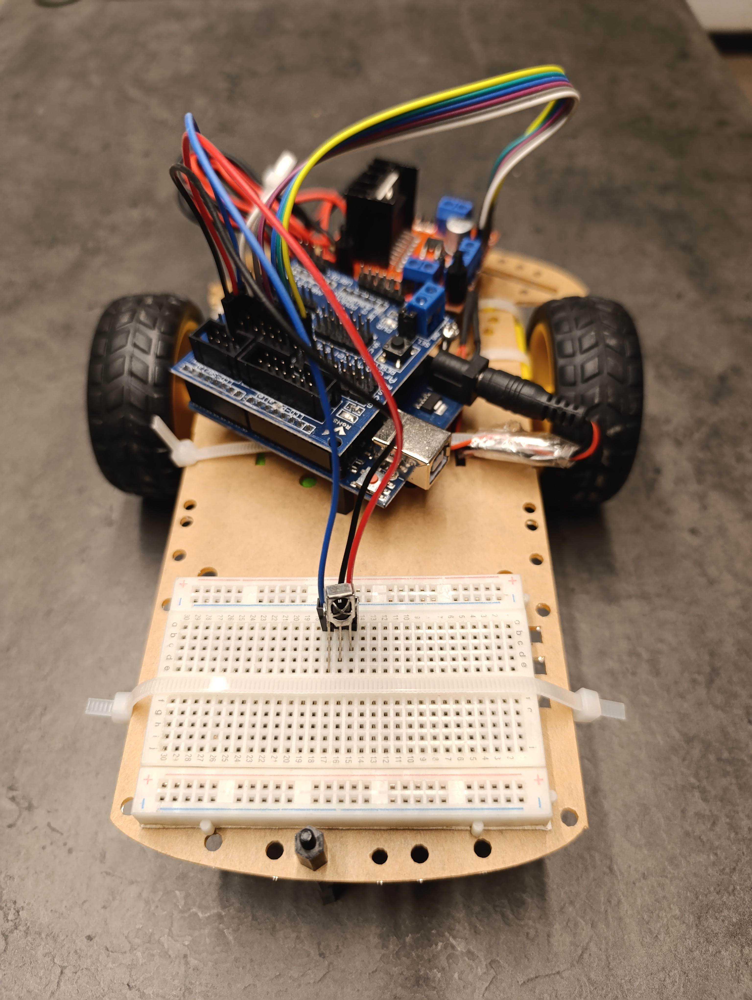

# Arduino Robot Control with IR Remote

## Overview
Remote-controlled Arduino robot using C++ firmware, a joystick, and IR communication, utilizing the IRremote library for signal transmission and PWM control to drive DC motors, with serial monitoring for debugging and real-time data visualization.
Extension: https://github.com/Oleg-lafer/Arduino-coordinate-navigator
<br />
This project features an Arduino-based robotic car that records a user-defined path via joystick input and autonomously replays it using motor control and geometric path calculations. The system filters joystick signals, stores key points based on distance thresholds, and translates them into motor commands. A simulated traffic light with LED signals and buzzer enhances realism. The project showcases embedded systems, motion control, and real-time signal processing.

<div style="display: flex;">
  
  
</div>


---

## Features
1. **Joystick Input:**  
   - Converts analog joystick readings into discrete values for movement control.
   - Maps joystick values to hexadecimal IR codes for transmission.

2. **Infrared Communication:**  
   - Utilizes the `IRremote.h` library for sending and receiving IR signals.
   - Sends joystick-based movement commands as Sony IR codes.

3. **Motor Control:**  
   - Two DC motors are controlled via PWM signals.
   - Supports forward, backward, left, and right movements based on IR commands.

4. **Serial Monitoring:**  
   - Displays joystick values and encoded transmission data for debugging and analysis.

---

## Components Used
- Arduino Uno (or compatible)
- Joystick Module
- IR LED for transmitting signals
- IR Receiver Module for receiving signals
- Two DC Motors with Motor Driver
- Robot chassis

---

## Code Highlights

### Joystick to IR Transmission
The joystick's analog values (`joyX` and `joyY`) are read, scaled, and encoded into a single hexadecimal value:
```cpp
int RVx = analogRead(joyX);
int RVy = analogRead(joyY);

int xTx = RVx / levels;
int yTx = RVy / levels;

int hexTx = xTx + yTx * 16;

irsend.sendSony(hexTx, 12);
```

### IR Signal Decoding and Motor Control
The received IR signals are decoded and mapped to specific motor actions:
```cpp
if (results.value == button2_forward) {
    moveForward();
} else if (results.value == button4_left) {
    moveLeft();
} else if (results.value == button6_right) {
    moveRight();
} else if (results.value == button8_backwards) {
    moveBackward();
}
```

---

## Functions
### Movement Functions
Each movement function (e.g., `moveForward`, `moveLeft`) controls the motor pins and PWM signals for the desired direction.
```cpp
void moveForward() {
    digitalWrite(LeftForward, HIGH);
    digitalWrite(LeftBackward, LOW);
    digitalWrite(RightForward, HIGH);
    digitalWrite(RightBackward, LOW);
    analogWrite(LeftPWM, 255);
    analogWrite(RightPWM, 255);
    delay(1000);
    stopMotors();
}
```

### Stop Motors
Stops all motor movement:
```cpp
void stopMotors() {
    analogWrite(RightPWM, 0);
    analogWrite(LeftPWM, 0);
}
```

---

## How to Use
1. Connect the joystick, IR LED, IR receiver, and motors as per the circuit diagram.
2. Upload the code to the Arduino board.
3. Use the joystick to send movement commands:
   - Move the joystick to control the car's direction (forward, backward, left, or right).
   - Commands are transmitted via IR and received by the robot.

---

## Potential Improvements
- Add obstacle detection with ultrasonic sensors.
- Implement speed control based on joystick intensity.
- Introduce autonomous modes like line following or object avoidance.
- Enhance command robustness with error detection for IR signals.

---

This project is an excellent introduction to remote-controlled robotics, combining hardware and software for a fun, interactive experience. Customize it further to explore advanced robotic functionalities!
